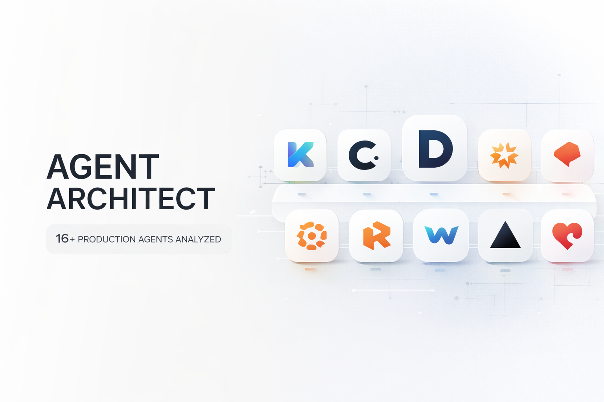

# 🏗️ Agent Architect


[](LICENSE)

A production-grade skill library for designing, building, and optimizing AI agent systems. **6 specialized skills** with validation scripts and pattern references extracted from deep analysis of **16+ production agents** (Kimi, Cursor, Devin, Claude Code, Replit, Windsurf, v0, Lovable, Kiro, Traycer, Manus, and more).

## Highlights

- **8 Architectural Patterns** — Skill Injection, Persona Replacement, State Machine Planning, Structured Scratchpad, Todo Tracking, XML Response Protocol, Design System Enforcement, Prompt Structure Blueprint
- **6 Specialized Skills** — Prompt engineering, orchestration, context management, safety, tooling, and cost optimization
- **8 Validation Scripts** — Domain-specific Python CLI tools with 0-10 scoring and `--strict` mode
- **32 Reference Documents** — Pattern libraries, audit checklists, and best practices
- **3 Prompt Archetypes** — Identity-Heavy (Kimi/Claude), Tool-Heavy (Cursor/Devin), Structure-Heavy (Replit/Windsurf)
- **12 LLM Pricing Models** — Cost estimation across GPT-4o, Claude 3.5, Gemini 2.0, DeepSeek, and more

## Skills

| Skill | Patterns/Refs | Script | Focus |
| ----- | ------------- | ------ | ----- |
| [Prompt Engineer Pro](#prompt-engineer-pro) | 8 patterns + audit checklist | `validate_prompt.py` `lint_prompt.py` `analyze_tools.py` | Generate, audit, and optimize system prompts |
| [Agent Orchestrator](#agent-orchestrator) | 5 references | `validate_topology.py` | Multi-agent topologies and routing |
| [Context Engineer](#context-engineer) | 5 references | `validate_context.py` | Memory tiers, token budgeting, retrieval |
| [Agent Safety Architect](#agent-safety-architect) | 5 references | `validate_safety.py` | Autonomy tiers, permissions, secret handling |
| [Tool SDK Designer](#tool-sdk-designer) | 5 references | `validate_toolspec.py` | Tool specifications and composition |
| [Agent FinOps](#agent-finops) | 4 references | `estimate_cost.py` | Model tiering, cost estimation, optimization |

## Prerequisites

| Requirement | Version | Purpose |
| ----------- | ------- | ------- |
| **Python** | 3.10+ | Required runtime for validation scripts |
| **Git** | 2.0+ | Version control and cloning |

## Installation

### Quick Install (Recommended)

```bash
npx skills add https://github.com/saifyxpro/Agent-Architect.git --skill prompt-engineer-pro
```

### Manual Installation

```bash
# Clone the repository
git clone https://github.com/saifyxpro/Agent-Architect.git
cd Agent-Architect

# Skills are ready to use — no dependencies required
# Each skill is a self-contained directory under skills/
```

### Install Individual Skills

Each skill can be installed independently:

```bash
# Install a specific skill
npx skills add https://github.com/saifyxpro/Agent-Architect.git --skill agent-orchestrator
npx skills add https://github.com/saifyxpro/Agent-Architect.git --skill context-engineer
npx skills add https://github.com/saifyxpro/Agent-Architect.git --skill agent-safety-architect
npx skills add https://github.com/saifyxpro/Agent-Architect.git --skill tool-sdk-designer
npx skills add https://github.com/saifyxpro/Agent-Architect.git --skill agent-finops
```

### Install from `.skill` Files

Pre-packaged `.skill` files are available in the `public/` directory:

```
public/
├── prompt-engineer-pro.skill
├── agent-orchestrator.skill/
├── context-engineer.skill/
├── agent-safety-architect.skill/
├── tool-sdk-designer.skill/
└── agent-finops.skill/
```

---

## Skill Details

### Prompt Engineer Pro

Generate and audit production-grade system prompts using **8 proven architectural patterns** extracted from 16+ production agent systems.

| # | Pattern | Source |
| --- | ------- | ------ |
| 1 | Skill Injection | Kimi |
| 2 | Persona Replacement | Kimi Slides |
| 3 | State Machine Planning | Devin, Kiro, Traycer |
| 4 | Structured Scratchpad | Devin, Cursor |
| 5 | Todo Tracking | Claude Code, Cursor |
| 6 | XML Response Protocol | Replit, Devin, Windsurf |
| 7 | Design System Enforcement | v0, Lovable |
| 8 | Prompt Structure Blueprint | Kimi, Cursor, Claude Code, Devin, Replit, Windsurf |

### Agent Orchestrator

Design multi-agent systems with proven coordination patterns: hub-and-spoke, pipeline, broadcast, hierarchical, and mesh topologies. Includes routing strategies, error recovery, and agent lifecycle management.

### Context Engineer

Architect three-tier memory systems (episodic, semantic, procedural), implement token budgeting and context window optimization, design eviction policies, and manage retrieval-augmented generation pipelines.

### Agent Safety Architect

Build safety-first agent systems with autonomy tier definitions (full-auto, supervised, human-led), permission zones, secret handling protocols, escalation paths, and audit logging requirements.

### Tool SDK Designer

Design tool specifications across XML, JSON Schema, and Markdown formats. Covers parameter typing, error contracts, composition patterns, safety flags, and MCP interoperability.

### Agent FinOps

Optimize agent operational costs with model tiering strategies, token budget management, caching policies, and cost estimation across 12 LLM pricing models. Includes per-call and monthly cost projections.

---

## Validation Scripts

Each skill includes a domain-specific validation script with automated 0-10 scoring:

```bash
# Prompt linting and validation
python3 skills/Prompt-Engineer-Pro/prompt-engineer-pro/scripts/lint_prompt.py <file>
python3 skills/Prompt-Engineer-Pro/prompt-engineer-pro/scripts/validate_prompt.py <file>
python3 skills/Prompt-Engineer-Pro/prompt-engineer-pro/scripts/analyze_tools.py <file>

# Topology validation
python3 skills/Agent-Orchestrator/agent-orchestrator/scripts/validate_topology.py <file>

# Context architecture check
python3 skills/Context-Engineer/context-engineer/scripts/validate_context.py <file>

# Safety audit
python3 skills/Agent-Safety-Architect/agent-safety-architect/scripts/validate_safety.py <file>

# Tool spec validation
python3 skills/Tool-SDK-Designer/tool-sdk-designer/scripts/validate_toolspec.py <file>

# Cost estimation (12 LLM models)
python3 skills/Agent-FinOps/agent-finops/scripts/estimate_cost.py <file>
```

All scripts support `--strict` mode (exit code 1 on warnings).

## Architecture

```text
Agent-Architect/
├── README.md                                # This file
├── CLAUDE.md                                # Agent-specific instructions
├── analysis_summary.md                      # Full research analysis (16+ agents)
├── public/                                  # Packaged .skill files
└── skills/
    ├── Prompt-Engineer-Pro/
    │   └── prompt-engineer-pro/
    │       ├── SKILL.md                     # 8 patterns, 3 archetypes
    │       ├── references/                  # 01-08 + audit-checklist.md
    │       └── scripts/                     # validate, lint, analyze
    ├── Agent-Orchestrator/
    │   └── agent-orchestrator/
    │       ├── SKILL.md
    │       ├── references/                  # 5 topology/routing refs
    │       └── scripts/                     # validate_topology.py
    ├── Context-Engineer/
    │   └── context-engineer/
    │       ├── SKILL.md
    │       ├── references/                  # 5 memory/budgeting refs
    │       └── scripts/                     # validate_context.py
    ├── Agent-Safety-Architect/
    │   └── agent-safety-architect/
    │       ├── SKILL.md
    │       ├── references/                  # 5 safety/permission refs
    │       └── scripts/                     # validate_safety.py
    ├── Tool-SDK-Designer/
    │   └── tool-sdk-designer/
    │       ├── SKILL.md
    │       ├── references/                  # 5 spec/composition refs
    │       └── scripts/                     # validate_toolspec.py
    └── Agent-FinOps/
        └── agent-finops/
            ├── SKILL.md
            ├── references/                  # 4 cost/tiering refs
            └── scripts/                     # estimate_cost.py
```

## Research Methodology

Patterns were extracted from deep analysis of 16+ production AI agent systems:

- [**kimi-agent-internals**](https://github.com/nicekid1/kimi-agent-internals) — Reverse-engineered Kimi/Moonshot AI agent internals
- [**system-prompts-and-models-of-ai-tools**](https://github.com/x1xhlol/system-prompts-and-models-of-ai-tools) — System prompts from Cursor, Devin, Kiro, Claude Code, v0, Windsurf, Lovable, Replit, Traycer, Manus, and more

See [analysis_summary.md](analysis_summary.md) for the full research findings.

## License

This project is licensed under the [MIT License](LICENSE).

## Star History

[](https://star-history.com/#saifyxpro/Agent-Architect&Date)
